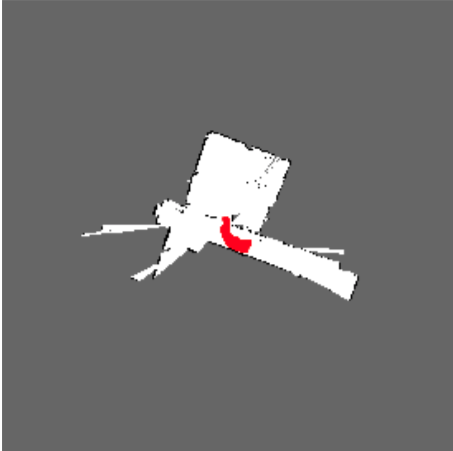
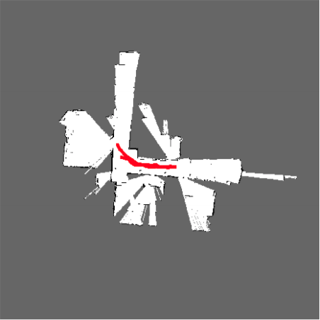

# Particle SLAM

Description
===========
This is project on Particle Filter SLAM is done by Ayon Biswas[A53318795].

Code organization
=================
*pslam.py -- Run the script for performing SLAM by by setting a dataset and setting parameters such as the number of particles and effective particles.

*load_data.py -- contains helper functions to load lidar data and robot's odometry and pose data.
 
*utils.py -- contains helper functions for computing map correlation, coordinate transformation from lidar to world frame, computing unoccupied cells and updating log-odds.

Results
=======
   
Map1 Map2
   

Datasets
========
The dataset was provided with the starter code.

Parameters
======
The parameters which worked with all the datasets are initialised in the script pslam.py

Acknowledgements
================
We thank Prof. Nikolay Atanasov and TAs for their guidance and support.
